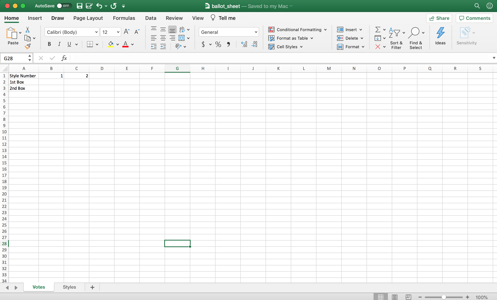
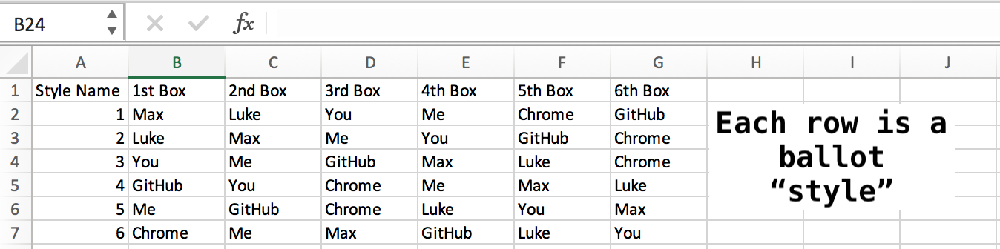
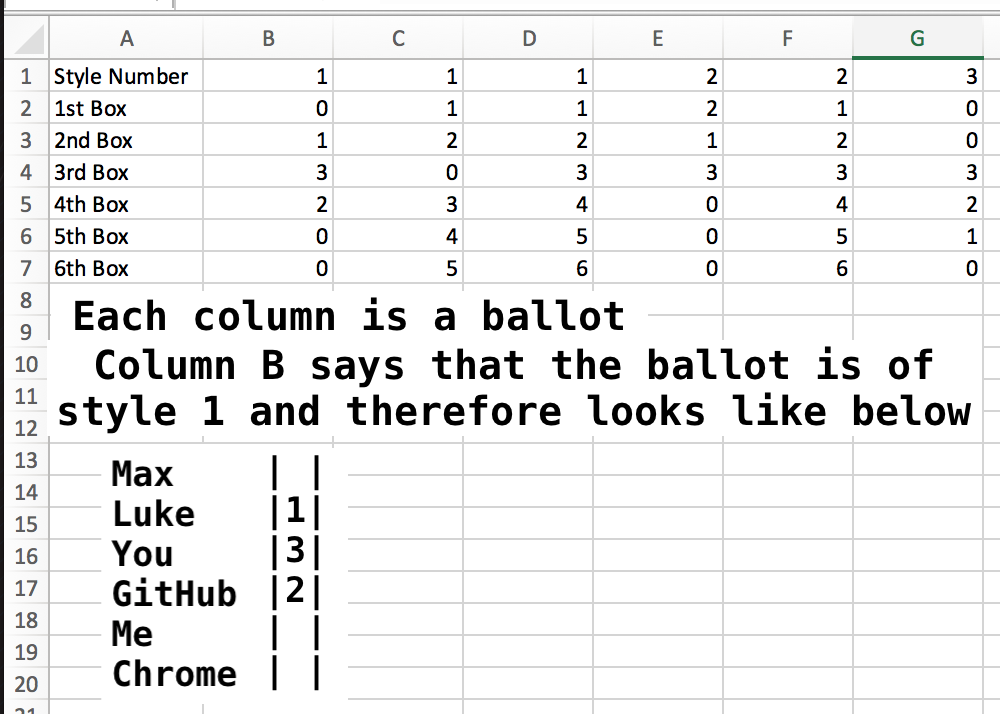
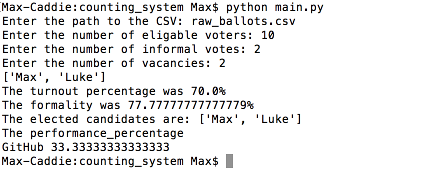

# Ormond Voting System
An automatic vote counting system created in collaboration with Luke Jacobson @jukelacobson1 https://github.com/jukelacobson1. 

# Why?
We created this to speed up the calculation of the Ormond College election results. The results are calculated using the single transferable vote system, similar to how the Australian Senate is elected.

# Benefits
This system is used to great effect to speed up our election process. Our General Council elections used to take around ten hours to tally up all the votes by hand, we estimate that with our system the process should take a fifth of the time (two hours for the GC elections).

Hopefully, this will be of great help to the college returning officer in October for running the general elections. This system could also be of use to anyone looking to run any elections using the single transferable vote system.

# Further Improvements
The current system uses excel as the data entry method. While we have streamlined this process as much as we could think of there is room for improvement.
  1. Creating collaboration tools. The current workflow for having mutiple people count votes requires them to keep individual sheets and then combine them into a master sheet.
  2. Run the system as a web application. Storing data in the cloud so that it could be accessed on multiple devices.
  3. Adding a optical character reader, so that ballots could be scanned. In the current workflow the biggest time sink is data entry.

# Demo

#### The voting data will be entered into `ballot_sheet.xlsx`, this is what the sheet should look like after being downloaded.

#### Enter your voting data in the following format, note there are two sheets inside this spreadsheet.
##### The style sheet

##### The vote sheet

#### Follow the installation process at the bottom, navigating through the two python programs

##### The output of the input system

##### The output of the counting system
*Note an extra ballot was added, compared to images above, in order to demonstrate the output from performance percentages*

#### You are done!

# Installation Proccess

1. Download the repository, there should be a green button with `Clone or Download` near the top of this page
2. Install any version of python3 from https://www.python.org/downloads/
3. Install openpyxl, which allows the reading and writing of Excel files `pythonX.X -m pip install --user -U openpyxl==2.6.2`, where X.X should be the version number of python you have installed
4. The program is installed and ready to run (see below)

# Running process

1. Using Finder/File Manager navigate to the folder you have cloned, then the folder called input_system
2. Enter your voting data into the excel file called `ballot_sheet.xlsx`, following the format in the demo (above)
3. Open up terminal/command prompt and navigate to the directory input_system. Using the cd and ls commands.
4. Run the command `python3 main.py`
5. When it asks for excel file name enter, `ballot_sheet`. If you have changed the name of the file use the new name of the file instead of ballot_sheet
5. A file called `raw_ballots.csv` should have been generated
6. Copy this file and navigate out one directory and then into couting_system
7. Paste the `raw_ballots.csv` into this directory
8. Again run `python3 main.py`
9. When it asks for a path to the csv enter `raw_ballots.csv`
10. Enter all the information it asks for, then your results should be generated!

